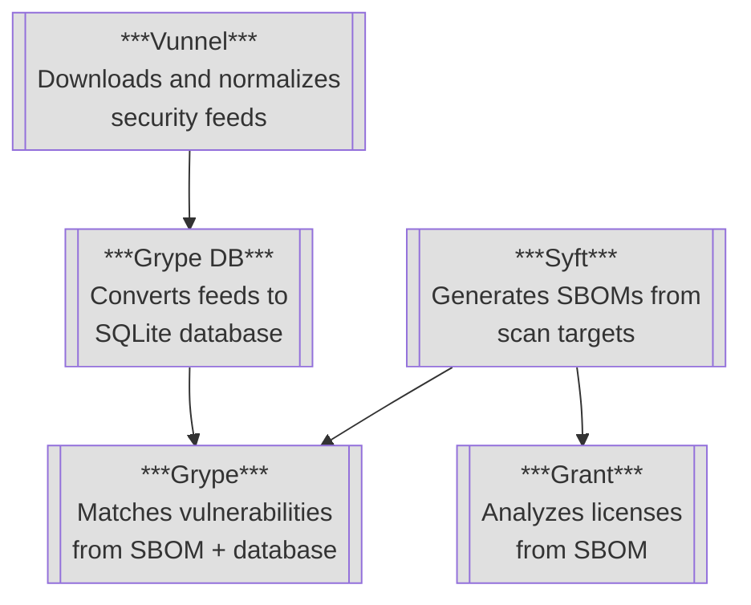
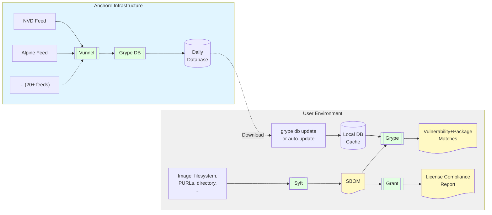

+++
title = "Architecture"
description = "How all the projects and datasets fit together"
weight = 60
url = "architecture"
menu_group = "general"
+++

Anchore's open source security tooling consists of several interconnected tools that work together to detect vulnerabilities and ensure license compliance in software packages. This page explains how these tools interact and how data flows through the system.

The Anchore OSS ecosystem includes five main tools that, at the 30,000 ft view, work together as follows:

Zooming in to the 20,000 ft view, here's how data flows through the same system:

