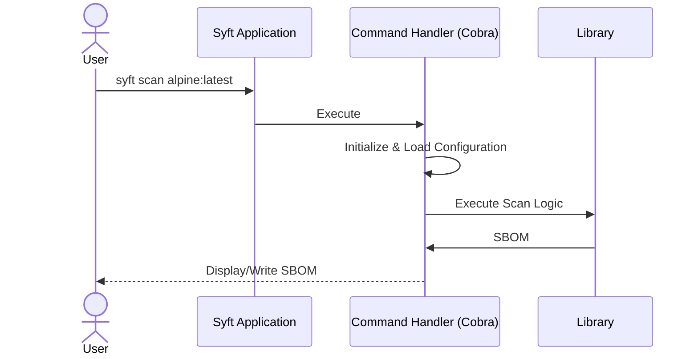
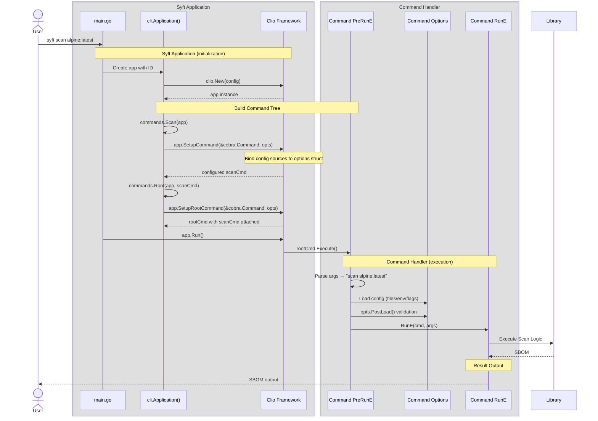
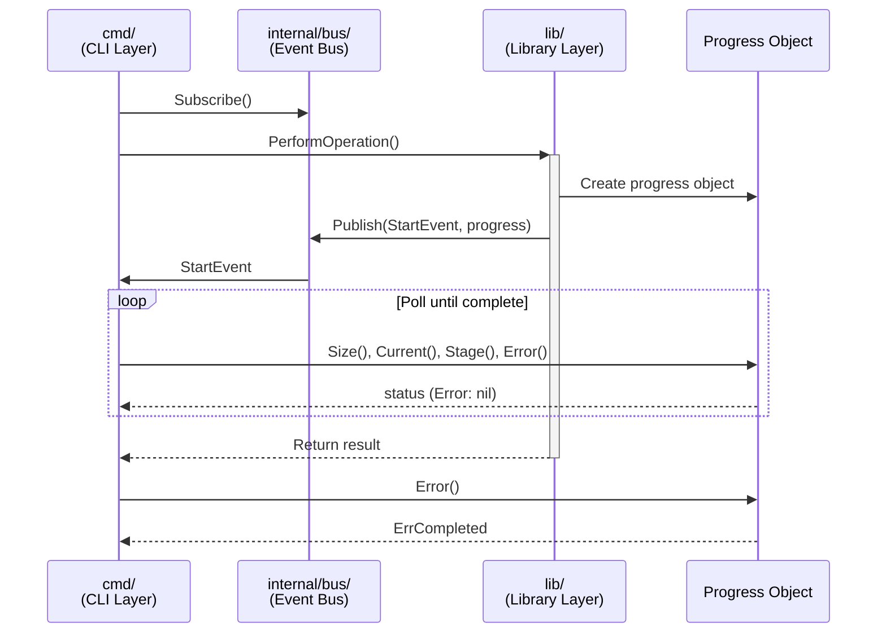

+++
title = "Go CLI patterms"
description = "All of the common patterns used in our go-based CLIs"
weight = 10
categories = ["architecture"]
tags = ["cli"]
menu_group = "general"
+++



We use...

- [Clio](https://github.com/anchore/clio) to orchestrate [cobra](https://github.com/spf13/cobra) and [viper](https://github.com/spf13/viper), covering CLI arg parsing and config file + env var loading.
- An [event bus](https://github.com/wagoodman/go-partybus) to enabling visibility deep in your execution stack, driving the UI experience.
- A [logger interface](https://github.com/anchore/go-logger), allowing you to swap out for any concrete logger you'd like (including built in redaction support).
- [bubbletea](https://github.com/charmbracelet/bubbletea) as the TUI framework with the [bubbly](https://github.com/anchore/bubbly) component library.
- [binny](https://github.com/anchore/binny) for managing specific versions of developer binary tools for local development.
- [goreleaser](https://goreleaser.com/) for building and publishing releases.
- [chronicle](https://github.com/anchore/chronicle) for automatically generating release notes based on github issues and PR titles/labels.
- [quill](https://github.com/anchore/quill) for signing and notarizing release binaries for Mac.



This document explains how all of the golang-base Anchore OSS tools are organized, covering the
package structure, common core architectural concepts, and where key functionality is implemented.

Use this as a reference when trying to familiarize yourself with the overall structure of Syft, Grype, or other applications.

## CLI

The `cmd` package uses the [Clio framework](https://github.com/anchore/clio) (built on top of the [`spf13/cobra`](https://github.com/spf13/cobra) and [`spf13/viper`](https://github.com/spf13/viper)) to manage flag/argument parsing, configuration, and command execution.

All flags, arguments, and config arguments are represented in the application as a struct.
Each command tends to get it's own struct with all options the command needs to function.
Common options or sets of options can be defined independently and reused across commands, being composed within each command struct that needs the option.

Select options that represent flags are registered with the `AddFlags` method defined on the command struct (or on each option struct used within the command struct).
If any additional processing is needed to be done to elements in command structs or option structs before being used in the application then you can define a `PostLoad` method on the struct to mutate the elements you need.

In terms of what is executed when: all processing is done within the selected cobra command's `PreRun` hook, wrapping any potential user-provided hook.
This means that all of this fits nicely into the existing cobra command lifecycle.

See the [`sign` command](https://github.com/anchore/quill/blob/main/cmd/quill/cli/commands/sign.go) in [Quill](https://github.com/anchore/quill) for a small example of all of this together.

The reason for this approach is to smooth over the rough edges between cobra and viper, which have multiple ways to configure and use functionality, and provide a single way to specify any input into the application.
Being prescriptive about these approaches has allowed us to take many shared concerns that used to be a lot of boilerplate when creating an application and put it into one framework --[Clio](https://github.com/anchore/clio).

### Execution flow

The following diagrams show the execution of a typical Anchore application at different levels of detail, using the `scan` command in Syft as a representative example:














## Package structure

Many of the Anchore OSS tools have the following setup (or very similar):

- **`/cmd/NAME/`** - _CLI application layer_.
  This is the entry point for the command-line tool and wires up much of the functionality from the public API.

  ```
  ./cmd/NAME/
  │   ├── cli/
  │   │   ├── cli.go          // where all commands are wired up
  │   │   ├── commands/       // all command implementations
  │   │   ├── options/        // all command flags and configuration options
  │   │   └── ui/             // all handlers for events that are shown on the UI
  │   └── main.go             // entrypoint for the application
  ...
  ```

- **`/NAME/`** - _Public library API_.
  This is how API users interact with the underlying capabilities without coupling to the application configuration, specific presentation on the terminal, or high-level workflows.

### The internalization philosophy

Applications extensively use `internal/` packages at multiple levels to minimize the public API surface area.
The codebase follows the guiding principle "internalize anything you can" - expose only what library consumers truly need.

Take for example the various `internal` packages within Syft

```
/internal/               # Project-wide internals (bus, log, etc...)
/syft/internal/          # Syft library-specific internals (relationships, evidence)
/cmd/syft/internal/      # CLI-specific internals (options, UI handlers)
/syft/source/internal/   # Package-specific internals (source resolution details)
/syft/pkg/cataloger/<ecosystem>/internal/  # Cataloger-specific internals
```

This multi-level approach allows Syft to expose a minimal, stable public API while keeping implementation details flexible and changeable.
Go's module system prevents importing `internal/` packages from outside their parent directory, which enforces clean separation of concerns.

## Core facilities

### The bus system

The bus system, under `/internal/bus/` within the target application, is an event publishing mechanism that enables progress reporting and UI updates
without coupling the library to any specific user interface implementation.

The bus follows a strict one-way communication pattern: the library publishes events but never subscribes to them.
The intention is that functionality is NOT fulfilled by listening to events on the bus and taking action.
Only the application layer (CLI) subscribes to events for display.
This keeps the library completely decoupled from UI concerns.

You can think of the bus as a structured extension of the logger, allowing for publishing not just strings or maps of strings,
but enabling publishing objects that can yield additional telemetry on-demand, fueling richer interactions.

This enables library consumers to implement any UI they want (terminal UI, web UI, no UI) by subscribing to events and handling them appropriately.
The library has zero knowledge of how events are used, maintaining a clean separation between business logic and presentation.

The bus is implemented as a singleton with a global publisher that can be set by library consumers:

```go
var publisher partybus.Publisher

func Set(p partybus.Publisher) {
    publisher = p
}

func Publish(e partybus.Event) {
    if publisher != nil {
        publisher.Publish(e)
    }
}
```

The library calls `bus.Publish()` throughout cataloging operations. If no publisher is set, events are silently discarded.
This makes events truly optional.

#### Event streams

Picking the right "level" for events is key. Libraries tend to not assume that events can be read "quickly" off the bus.
At the same time, to remain lively and useful, we want to be able to have consumers of the bus to get information
at a rate they choose. A common pattern used is to publish a "start" event (for example, "cataloging started") and
publish with that event a read-only, thread-safe object that can be polled by the caller to get progress or status-based
information out.



This prevents against the library accidentally being a "firehose" and overwhelming subscribers who are trying to convey
timely information. When subscribers cannot keep up with the amount of events emitted from the library then the very
information being displayed tends to get stale and useless anyway. At the same time, the there is a lot of value in
responding to events instead of polling for all information.

This pattern helps to balance the best of both worlds, getting an event driven system with a consumer-driven update
cadence.

### The logging system

The logging system, under `/internal/log/` within the target application, provides structured logging throughout Anchore's applications with an injectable [logger interface](https://github.com/anchore/go-logger/blob/main/logger.go).
This allows library consumers to integrate the application's logging into their own logging infrastructure.
There is an [adapter for logrus](https://github.com/anchore/go-logger/tree/main/adapter/logrus) to this interface implemented, and we're happy to take additional contributions for other concrete logger adapters.

The logging system is implemented as a singleton with global functions (`log.Info`, `log.Debug`, etc.).
Library consumers inject their logger by calling the public API function `syft.SetLogger(yourLoggerHere)`.

By default, Syft uses a discard logger (no-op) that silently ignores all log messages.
This ensures the library produces no output unless a logger is explicitly provided.

All loggers are automatically wrapped with a redaction layer when you call `SetLogger()`.
The wrapping is applied internally by the logging system, which removes sensitive information (like authentication tokens) from log output.
This happens transparently within the application CLI, however, API users will need to explicitly register secrets to be redacted.

## Releasing

Each application uses [goreleaser](https://goreleaser.com/) to build and publish releases, as orchestrated by a [`release`](https://github.com/anchore/syft/blob/main/.github/workflows/release.yaml) workflow.

The release workflow can be triggered with `make release` from a local checkout of the repository.
[Chronicle](https://github.com/anchore/chronicle) is used to automatically generate release notes based on GitHub issues and PR titles/labels,
using the same information to determine the next version for the release.

With each repo, we tend to publish (but some details may vary slightly between repos):

- a tag with the version (e.g., `v0.50.0`)
- binaries for Linux, Mac, and Windows, uploaded as GitHub release assets (note, we sign and notarize Mac binaries with [Quill](https://github.com/anchore/quill))
- Docker images, pushed to Docker Hub and `ghcr.io` registries
- Update homebrew taps

We ensure the same tool versions are used locally and in CI by using [Binny](https://github.com/anchore/binny), orchestrated with `make` and [`task`](https://taskfile.dev/).
