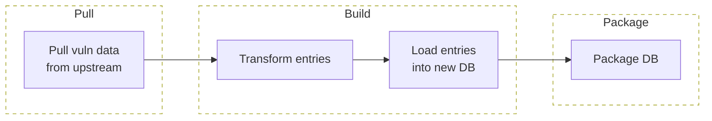
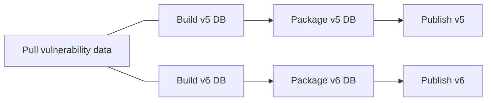
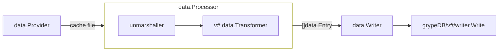
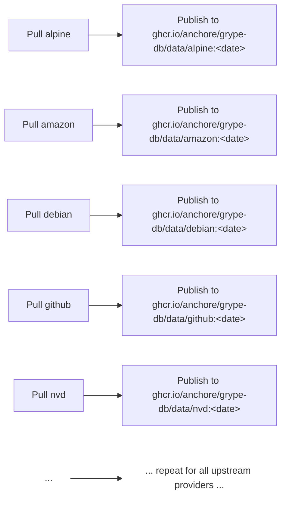
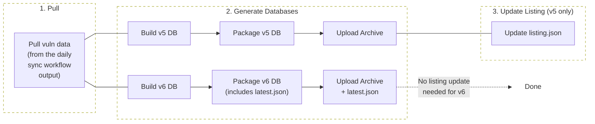

+++
title = "Grype DB"
description = "Architecture and design of the Grype vulnerability database build system"
weight = 30
categories = ["architecture"]
tags = ["grype-db", "vunnel"]
menu_group = "projects"
+++

## Overview

`grype-db` is essentially an application that extracts information from upstream vulnerability data providers, transforms it into smaller records targeted for Grype consumption, and loads the individual records into a new SQLite DB.



## Multi-Schema Support Architecture

What makes `grype-db` unique compared to a typical ETL job is the extra responsibility of needing to transform the most recent vulnerability data shape (defined in the [vunnel repo](https://github.com/anchore/vunnel/tree/main/schema/vulnerability)) to all supported DB schema versions.

From the perspective of the Daily DB Publisher workflow, (abridged) execution looks something like this:



## Core Abstractions

In order to support multiple DB schemas easily from a code-organization perspective, the following abstractions exist:

- **[Provider](https://github.com/anchore/grype-db/blob/main/pkg/provider/provider.go)** - Responsible for providing raw vulnerability data files that are cached locally for later processing.

- **[Processor](https://github.com/anchore/grype-db/blob/main/pkg/data/processor.go)** - Responsible for unmarshalling any entries given by the `Provider`, passing them into `Transformers`, and returning any resulting entries. Note: the object definition is schema-agnostic but instances are schema-specific since Transformers are dependency-injected into this object.

- **Transformer** ([`v5`](https://github.com/anchore/grype-db/blob/main/pkg/process/v5/transformers), [`v6`](https://github.com/anchore/grype-db/blob/main/pkg/process/v6/transformers)) - Takes raw data entries of a specific [vunnel-defined schema](https://github.com/anchore/vunnel/tree/main/schema/vulnerability) and transforms the data into schema-specific entries to later be written to the database. Note: the object definition is schema-specific, encapsulating `grypeDB/v#` specific objects within schema-agnostic `Entry` objects.

- **[Entry](https://github.com/anchore/grype-db/blob/main/pkg/data/entry.go)** - Encapsulates schema-specific database records produced by `Processors`/`Transformers` (from the provider data) and accepted by `Writers`.

- **Writer** ([`v5`](https://github.com/anchore/grype-db/blob/main/pkg/process/v5/writer.go), [`v6`](https://github.com/anchore/grype-db/blob/main/pkg/process/v6/writer.go)) - Takes `Entry` objects and writes them to a backing store (today a SQLite database). Note: the object definition is schema-specific and typically references `grypeDB/v#` schema-specific writers.

## Data Flow

All the above abstractions are defined in the [`pkg/data`](https://github.com/anchore/grype-db/tree/main/pkg/data) Go package and are used together commonly in the following flow:



Where there is:

- A `data.Provider` for each upstream data source (e.g. canonical, redhat, github, NIST, etc.)
- A `data.Processor` for every vunnel-defined data shape (github, os, msrc, nvd, etc... defined in the [vunnel repo](https://github.com/anchore/vunnel/tree/main/schema/vulnerability))
- A `data.Transformer` for every processor and DB schema version pairing
- A `data.Writer` for every DB schema version

## Code Organization

From a Go package organization perspective, the above abstractions are organized as follows:

```
grype-db/
└── pkg
    ├── data                      # common data structures and objects that define the ETL flow
    ├── process
    │    ├── processors           # common data.Processors to call common unmarshallers and pass entries into data.Transformers
    │    ├── v5                   # schema v5 (legacy, active)
    │    │    ├── processors.go   # wires up all common data.Processors to v5-specific data.Transformers
    │    │    ├── writer.go       # v5-specific store writer
    │    │    └── transformers    # v5-specific transformers
    │    └── v6                   # schema v6 (current, active)
    │         ├── processors.go   # wires up all common data.Processors to v6-specific data.Transformers
    │         ├── writer.go       # v6-specific store writer
    │         └── transformers    # v6-specific transformers
    └── provider                  # common code to pull, unmarshal, and cache upstream vuln data into local files
        └── ...

```

Note: Historical schema versions (v1-v4) have been removed from the codebase.

## DB Structure and Definitions

The definitions of what goes into the database and how to access it (both reads and writes) live in the public [`grype` repo](https://github.com/anchore/grype) under the [`grype/db` package](https://github.com/anchore/grype/tree/main/grype/db). Responsibilities of `grype` (not `grype-db`) include (but are not limited to):

- What tables are in the database
- What columns are in each table
- How each record should be serialized for writing into the database
- How records should be read/written from/to the database
- Providing rich objects for dealing with schema-specific data structures
- The name of the SQLite DB file within an archive
- The definition of a listing file and listing file entries

The purpose of [`grype-db`](https://github.com/anchore/grype-db) is to use the definitions from [`grype/db`](https://github.com/anchore/grype/tree/main/grype/db) and the upstream vulnerability data to create DB archives and make them publicly available for consumption via Grype.

## DB Distribution Files

Grype DB currently supports two active schema versions, each with a different distribution mechanism:

- **Schema v5** _(legacy)_: Supports Grype v0.87.0+
- **Schema v6** _(current)_: Supports Grype main branch

Historical schemas (v1-v4) are no longer supported and their code has been removed from the codebase.

### Schema v5: listing.json

The [`listing.json` file](https://github.com/anchore/grype/blob/main/grype/db/v5/distribution/listing.go) is a legacy distribution mechanism used for schema v5 (and historically v1-v4):

- **Location**: `databases/listing.json`
- **Structure**: Contains URLs to DB archives organized by schema version, ordered by latest-date-first
- **Format**: `{ "available": { "1": [...], "2": [...], "5": [...] } }`
- **Update Process**: Re-generated daily by the grype-db publisher workflow through a separate listing update step

### Schema v6+: latest.json

The [`latest.json` file](https://github.com/anchore/grype/blob/main/grype/db/v6/distribution/latest.go) is the modern distribution mechanism used for schema v6 and future versions:

- **Location**: `databases/v{major}/latest.json` (e.g., `v6/latest.json`, `v7/latest.json`)
- **Structure**: Contains metadata and URL for the single latest DB archive for that major schema version
- **Format**: `{ "url": "...", "built": "...", "checksum": "...", "schemaVersion": 6 }`
- **Update Process**: Generated and uploaded atomically with each DB build (no separate update step)

This dual-distribution approach allows Grype to maintain backward compatibility with v5 while providing a more efficient distribution mechanism for v6 and future versions.

**Implementation Notes:**

- Distribution file definitions reside in the [`grype` repo](https://github.com/anchore/grype), while the [`grype-db` repo](https://github.com/anchore/grype-db) is responsible for generating DBs and creating/updating these distribution files
- As long as Grype has been configured to point to the correct distribution file URL, the DBs can be stored separately, replaced with a service returning the distribution file contents, or mirrored for systems behind an air gap

## Daily Workflows

There are two workflows that drive getting a new Grype DB out to OSS users:

1. The [daily data sync workflow](https://github.com/anchore/grype-db/blob/main/.github/workflows/daily-data-sync.yaml), which uses [vunnel](https://github.com/anchore/vunnel) to pull upstream vulnerability data.
2. The [daily DB publisher workflow](https://github.com/anchore/grype-db/blob/main/.github/workflows/daily-db-publisher-r2.yaml), which builds and publishes a Grype DB from the data obtained in the daily data sync workflow.

### Daily Data Sync Workflow

**This workflow takes the upstream vulnerability data (from canonical, redhat, debian, NVD, etc), processes it, and writes the results to OCI repos.**



Once all providers have been updated, a single vulnerability cache OCI repo is updated with all of the latest vulnerability data at `ghcr.io/anchore/grype-db/data:<date>`. This repo is what is used downstream by the DB publisher workflow to create Grype DBs.

The in-repo [`.grype-db.yaml`](https://github.com/anchore/grype-db/blob/main/.grype-db.yaml) and [`.vunnel.yaml`](https://github.com/anchore/grype-db/blob/main/.vunnel.yaml) configurations are used to define the upstream data sources, how to obtain them, and where to put the results locally.

### Daily DB Publishing Workflow

This workflow takes the latest vulnerability data cache, builds a Grype DB, and publishes it for general consumption:



The [`manager/` directory](https://github.com/anchore/grype-db/tree/main/manager) contains all code responsible for driving the [Daily DB Publisher workflow](https://github.com/anchore/grype-db/blob/main/.github/workflows/daily-db-publisher-r2.yaml), generating DBs for all supported schema versions (currently v5 and v6) and making them available to the public.

#### 1. Pull

Download the latest vulnerability data from various upstream data sources into a local directory. The destination for the provider data is in the [`data/vunnel`](https://github.com/anchore/grype-db/tree/main/data/vunnel) directory.

#### 2. Generate

Build databases for all supported schema versions based on the latest vulnerability data and upload them to Cloudflare R2 (S3-compatible storage).

**Supported Schemas** (see [`schema-info.json`](https://github.com/anchore/grype-db/blob/main/manager/src/grype_db_manager/data/schema-info.json)):

- Schema v5 (legacy)
- Schema v6 (current)

**Build and Upload Process:**

Each DB undergoes the following steps:

1. **Build**: Transform vulnerability data into the schema-specific format
2. **Package**: Create a compressed archive (`.tar.zst`)
3. **Validate**: Smoke test with Grype by comparing against the previous release using [vulnerability-match-labels](https://github.com/anchore/vulnerability-match-labels)
4. **Upload**: Only DBs that pass validation are uploaded

**Storage Location:**

- Distribution base URL: `https://grype.anchore.io/databases/...`
- Schema-specific paths:
  - v5: `databases/<archive-name>.tar.zst`
  - v6: `databases/v6/<archive-name>.tar.zst` + `databases/v6/latest.json`

**Key Difference:**

- **v5**: Only the DB archive is uploaded; discoverability happens in the next step
- **v6**: Both the DB archive AND `latest.json` are uploaded atomically, making the DB immediately discoverable

#### 3. Update Listing (v5 Only)

**This step only applies to schema v5.**

Generate and upload a new `listing.json` file to Cloudflare R2 based on the existing listing file and newly discovered DB archives.

The listing file is tested against installations of Grype to ensure scans can successfully discover and download the DB. The scan must have a non-zero count of matches to pass validation.

Once the listing file has been uploaded to `databases/listing.json`, user-facing Grype v5 installations can discover and download the new DB.

**Note:** Schema v6 does not require this step because the `latest.json` file is generated and uploaded atomically with the DB archive in step 2, with a 5-minute cache TTL for fast updates.

## Related Architecture

For more details on:

- How Vunnel processes vulnerability data, see the [Vunnel Architecture](/docs/architecture/vunnel) page
- How quality gates validate database builds, see the Quality Gates section
