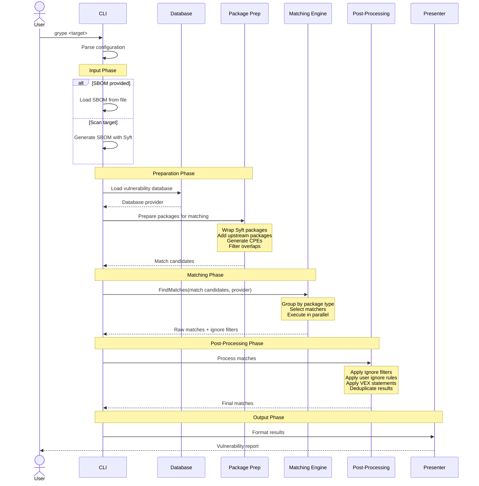
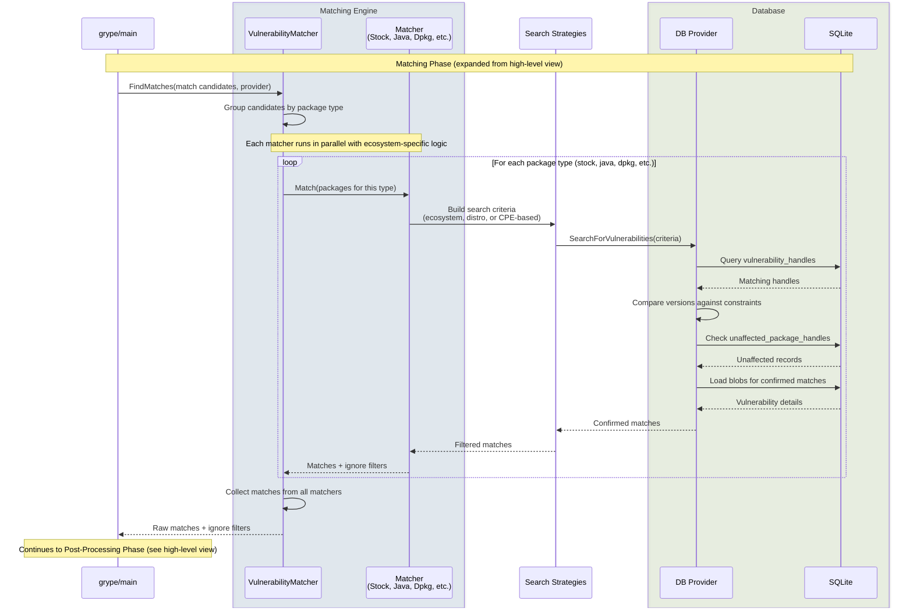
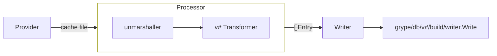

+++
title = "Grype"
description = "Architecture and design of the Grype vulnerability scanner"
weight = 20
categories = ["architecture"]
tags = ["grype"]
menu_group = "projects"
icon_image = "/images/logos/grype/favicon-48x48.png"
+++


See the [Golang CLI Patterns]() for **common structures and frameworks** used in Grype and across other Anchore open source projects.


## Code organization

At a high level, this is the package structure of Grype:

```
./cmd/grype/                // main entrypoint
│   └── ...
└── grype/                  // the "core" grype library
    ├── db/                 // vulnerability database management, schemas, readers, writers, and build utilities
    │   ├── data/           // common build abstractions: processors, transformers, entries, writers
    │   ├── processors/     // all data processors (nvd, osv, github, msrc, os, openvex, epss, kev, eol, etc.)
    │   ├── provider/       // provider file/state/workspace management for build inputs
    │   ├── v5/             // v5 database schema
    │   │   └── build/      // v5 build utilities (transformers, processors, writer)
    │   └── v6/             // v6 database schema
    │       └── build/      // v6 build utilities (transformers, processors, writer)
    ├── match/              // core types for matches and result processing
    ├── matcher/            // vulnerability matching strategies
    │   ├── stock/          // default matcher (ecosystem + CPE)
    │   └── <ecosystem>/    // ecosystem-specific matchers (java, dpkg, rpm, etc.)
    ├── pkg/                // types for package representation (wraps Syft packages)
    ├── search/             // search criteria and strategies
    ├── version/            // version comparison across formats
    ├── vulnerability/      // core types for vulnerabilities and provider interface
    └── presenter/          // output formatters (JSON, table, etc.)
```

The `grype` package and subpackages implement Grype's core library. The major packages work together in a pipeline:

- The `grype/pkg` package wraps Syft packages and prepares them as match candidates, augmenting them with upstream package information and CPEs.
- The `grype/matcher` package contains matching strategies that search for vulnerabilities matching specific package types.
- The `grype/db` package manages the vulnerability database and provides query interfaces for matchers.
- The `grype/vulnerability` package defines vulnerability data structures and the Provider interface for database queries.
- The `grype/search` package implements search strategies (ecosystem, distro, CPE) and criteria composition.
- The `grype/presenter` package formats match results into various output formats.

This design creates a clear flow: SBOM → package preparation → matching → results:









This diagram zooms into the **Matching Phase** from the high-level diagram, showing how the matching engine executes parallel matcher searches against the database. Components are grouped in boxes to show how they map to the high-level participants.






## Relationship to Syft

Grype uses Syft's SBOM generation capabilities rather than reimplementing package cataloging. The integration happens at two levels:

1. **External SBOMs**: You can provide an SBOM file generated by Syft (or any SPDX/CycloneDX SBOM), and Grype consumes it directly.
2. **Inline scanning**: When you provide a scan target (like a container image or directory), Grype invokes Syft internally to generate an SBOM, then immediately matches it against vulnerabilities.

The `grype/pkg` package wraps `syft/pkg.Package` objects and augments them with matching-specific data:

- **Upstream packages**: For packages built from source (like Debian or RPM packages), Grype adds references to the source package so it can search both the binary package name and source package name.
- **CPE generation**: Grype generates Common Platform Enumeration (CPE) identifiers for packages based on their metadata, enabling CPE-based matching as a fallback strategy.
- **Distro context**: Grype preserves the Linux distribution information from Syft to enable distro-specific vulnerability matching.

This wrapping pattern maintains a clear architectural boundary. Syft focuses on finding packages, while Grype focuses on finding vulnerabilities in those packages.

### Package representation

The `grype/pkg` package converts Syft packages into Grype match candidates. The `pkg.FromCollection()` function performs this conversion:

1. **Wraps each Syft package** in a `grype.Package` that preserves the original package data.
2. **Adds upstream packages** for packages that have source package relationships (e.g., a Debian binary package has a source package).
3. **Generates CPEs** based on package metadata (name, version, vendor, product).
4. **Filters overlapping packages** for comprehensive distros (like Debian or RPM-based distros) where you might have both installed packages and package files, preferring the installed packages.

The `grype.Package` type maintains a reference to the original `syft.Package` while augmenting it with:

- `Upstreams []UpstreamPackage`: Source packages to search in addition to the binary package.
- `CPEs []syftPkg.CPE`: Generated CPE identifiers for fallback matching.

This design preserves the complete SBOM information while preparing packages for the matching process. Matchers receive these enhanced packages and decide which attributes to use for searching.

## Data flow

The data flow through Grype follows these steps:

1. **SBOM ingestion**: Load an SBOM from a file or generate one by scanning a target.
2. **Package conversion**: Convert Syft packages into `grype.Package` match candidates, adding upstream packages, CPEs, and filtering overlapping packages.
3. **Matcher selection**: Group packages by type (e.g., Java, dpkg, npm) and select appropriate matchers.
4. **Parallel matching**: Execute matchers in parallel, each querying the database with search criteria specific to their package types.
5. **Result aggregation**: Collect matches from all matchers and apply deduplication using ignore filters.
6. **Post-processing**: Apply user-configured ignore rules, VEX (Vulnerability Exploitability eXchange) statements, and optional CVE normalization.
7. **Output formatting**: Format the final matches using the selected presenter (JSON, table, SARIF, etc.).

The database sits at the center of this flow. All matchers query the same database provider, but they use different search strategies based on their package types.

## Vulnerability database

Grype uses a SQLite database to store vulnerability data. The database design prioritizes query performance and storage efficiency.

In order to interoperate any DB schema with the high-level Grype engine, each schema must implement a [`Provider` interface](https://github.com/anchore/grype/blob/main/grype/vulnerability/provider.go).
This allows for DB specific schemas to be adapted to the core Grype types.

### `v6` Schema design

The overall design of the `v6` database schema is heavily influenced by the [OSV schema](https://ossf.github.io/osv-schema/),
so if you are familiar with OSV, many of the entities / concepts will feel similar.

The database uses a **blob + handle pattern**:

- **Handles**: Small, indexed records containing anything you might want to search by (package name, vulnerability id, provider name, etc.).
  Grype stores these in tables optimized for fast lookups. These tables point to blobs for full details.
  See the [Grype DB SQL schemas](https://github.com/anchore/grype/tree/main/schema/grype/db/sql) for more details on handle table structures.

- **Blobs**: Full JSON documents containing complete vulnerability details.
  Grype stores these separately and loads them only when a match is made.
  See the [Grype DB blob schemas](https://github.com/anchore/grype/tree/main/schema/grype/db/blob/json) for more details on blob structures.

This separation allows Grype to quickly query millions of vulnerability records without loading full vulnerability details until necessary.

Key tables include:

- `vulnerability_handles`: Searchable for vulnerability records by name (CVE/advisory ID), status (active, withdrawn, etc), published/modified/withdrawn dates, and provider ID.
  References a blob containing full vulnerability details (description, references, aliases, severities).

- `affected_package_handles`: Links vulnerabilities, packages, and (optionally) operating systems.
  The referenced blob contains version constraints (for example, "vulnerable in 1.0.0 to 1.2.5") and fix information.
  Used when the package ecosystem is known (npm, python, gem, etc.).

- `unaffected_package_handles`: Explicitly marks package versions that are NOT vulnerable.
  Same structure as affected_package_handles but represents exemptions.
  These are applied on top of any discovered affected records to remove matches (thus reduce false positives).

- `affected_cpe_handles`: Links vulnerabilities and explicit CPEs, useful when a CPE cannot be resolved to a clear package ecosystem.

- `packages`: Stores unique ecosystem + name combinations (for example, ecosystem='npm', name='lodash').

- `operating_systems`: Stores OS release information with name, major/minor version, codename, and channel (for example, RHEL EUS versus mainline).
  Provides context for distro-specific package matching.

- `cpes`: Stores parsed CPE 2.3 components (part, vendor, product, edition, etc.).
  Version constraints are stored in blobs, not in this table.

- `blobs`: Complete vulnerability, package, and decorator details as compressed JSON.
  There are 3 blob types:
  - `VulnerabilityBlob` (full vulnerability data)
  - `PackageBlob` (version ranges and fixes)
  - `KnownExploitedVulnerabilityBlob` (KEV catalog data).

Additional decorator tables enhance vulnerability information:

- `known_exploited_vulnerability_handles`: Links CVE identifiers to blob containing CISA KEV catalog data (date added, vendor, product, required action, ransomware campaign use).

- `epss_handles`: Stores EPSS (Exploit Prediction Scoring System) data with CVE identifier, EPSS score (0-1 probability), and percentile ranking.

- `cwe_handles`: Maps CVE identifiers to CWE (Common Weakness Enumeration) IDs with source and type information.

The schema also includes a `package_cpes` junction table creating many-to-many relationships between packages and CPEs.
When a CPE can be resolved to a package (via this table), vulnerabilities use `affected_package_handles`.
When a CPE cannot be resolved, vulnerabilities use `affected_cpe_handles` instead.

Grype versions the database schema (currently v6). When the schema changes, users download a new database file that Grype automatically detects and uses.

### Data organization

Relationships between tables enable efficient querying:

1. Matchers create search criteria (package name, version, distro, etc.).
2. The database provider queries the appropriate handle tables with these criteria.
3. The `grype/version` package filters handles by version constraints.
4. The provider loads the corresponding vulnerability blob for confirmed matches.
5. The complete vulnerability record returns to the matcher.

Version constraints in the database use multi-version constraint syntax, allowing a single record to express complex version ranges like "affected in 1.0.0 to 1.2.5 and 2.0.0 to 2.1.3".

## Matching engine

The matching engine orchestrates vulnerability matching across different package types. The core component is the `VulnerabilityMatcher`, which:

1. **Groups packages by type**: Java packages go to the Java matcher, dpkg packages to the dpkg matcher, etc.
2. **Selects matchers**: Each matcher declares which package types it handles.
3. **Executes matching**: Matchers run in parallel, querying the database with their specific search strategies.
4. **Collects results**: Matches from all matchers are aggregated.
5. **Applies ignore filters**: Matchers can mark certain matches to be ignored by other matchers, preventing duplicate reporting.

The ignore filter mechanism is important. For example, the dpkg matcher searches both the binary package name and the source package name. When it finds a match via the source package, it creates an ignore filter so the stock matcher doesn't report the same vulnerability using a CPE match. This prevents duplicate matches for the same vulnerability.

### Matchers

Each matcher implements the [`Matcher` interface](https://github.com/anchore/grype/blob/main/grype/match/matcher.go).
This allows Grype to support multiple matching strategies for different package ecosystems.

The process of making a match involves several steps:

1. **Candidate creation**: Matchers create match candidates when database records meet search criteria.
2. **Version comparison**: The `grype/version` package compares the package version against the vulnerability's version constraints.
3. **Unaffected check**: If the database has an explicit "not affected" record for this version, the match is rejected.
4. **Match creation**: Confirmed matches become `Match` objects with confidence scores (the scores are currently unused).
5. **Ignore filter check**: Matches are checked against ignore filters from other matchers.
6. **User ignore rules**: Matches are checked against user-configured ignore rules.

## Search strategies

Matchers determine what to search for based on package type and available metadata. Grype supports three main search strategies:

- **Ecosystem search**: Queries vulnerabilities by package name and version within a specific package ecosystem (npm, pypi, gem, etc.). Search fields include ecosystem, package name, and version. The database returns handles where the package name matches and version constraints include the specified version.

- **Distro search**: Queries vulnerabilities by Linux distribution, package name, and version for OS packages managed by apt, yum, or apk. Search fields include distro name and version (for example, debian:10), package name, and version. Also understands distro channels like RHEL EUS versus mainline.

- **CPE matching**: Fallback strategy when ecosystem or distro matching isn't applicable, using CPE identifiers in the format `cpe:2.3:a:vendor:product:version:...`. Search fields include CPE components (part, vendor, product). Broader and less precise than ecosystem matching, used primarily when ecosystem data isn't available.

### Search criteria system

The `grype/search` package provides a criteria system that matchers use to express search requirements.
Criteria can be combined with AND and OR operators:

- `AND(ecosystem("npm"), packageName("lodash"), version("4.17.20"))`
- `OR(distro("debian:10"), distro("debian:11"))`

The database provider translates these criteria into SQL queries against the handle tables.
This abstraction allows matchers to express complex search requirements without writing SQL directly.

Ideally, matchers orchestrate search criteria at a high level, letting each specific criteria type handle its own needs.
It's the vulnerability provider that ultimately translates criteria into efficient database queries.

## Version comparison

Grype supports multiple version formats because different ecosystems have different versioning schemes.
The [`grype/version`](https://github.com/anchore/grype/tree/main/grype/version) package provides format-specific version comparers,
falling back to a "catch all" fuzzy comparer when the format cannot be determined.

Each format has its own constraint parser that understands ecosystem-specific constraint syntax.
The version comparison system detects the appropriate format based on the package type,
then uses the correct comparer to evaluate version constraints from the database.

The records from the Grype DB specify which version format to use on one side of the comparison, and the package type determines the format on the other side.
If no specific format is found, or the formats are incompatible (essentially do not match), the fuzzy comparer is used as a last resort.

## DB build utilities

The `grype/db` package holds both the **read-side** logic (schema definitions, readers, and the vulnerability provider used during scanning) and the **write-side** logic (the build utilities that transforms raw vulnerability data into a Grype database). The [Grype DB]() CLI orchestrates the build utilities, but all transformation and writing logic lives here in the grype library.

### Core abstractions

The build utilities uses the following abstractions, defined in the [`grype/db/data`](https://github.com/anchore/grype/tree/main/grype/db/data) package:

- **[Processor](https://github.com/anchore/grype/blob/main/grype/db/data/processor.go)** - Unmarshals entries from a given provider, passes them into Transformers, and returns resulting entries. The object definition is schema-agnostic, but instances are schema-specific since Transformers are dependency-injected.

- **[Transformer](https://github.com/anchore/grype/blob/main/grype/db/data/transformers.go)** ([`v5`](https://github.com/anchore/grype/tree/main/grype/db/v5/build/transformers), [`v6`](https://github.com/anchore/grype/tree/main/grype/db/v6/build/transformers)) - Takes raw data entries of a specific [vunnel-defined schema](https://github.com/anchore/vunnel/tree/main/schema/vulnerability) and transforms them into schema-specific entries for database writing.

- **[Entry](https://github.com/anchore/grype/blob/main/grype/db/data/entry.go)** - Encapsulates schema-specific database records produced by Processors/Transformers and accepted by Writers.

- **[Writer](https://github.com/anchore/grype/blob/main/grype/db/data/writer.go)** ([`v5`](https://github.com/anchore/grype/blob/main/grype/db/v5/build/writer.go), [`v6`](https://github.com/anchore/grype/blob/main/grype/db/v6/build/writer.go)) - Takes Entry objects and writes them to a backing store (a SQLite database).

### Data flow

These abstractions work together in the following flow:



Where there is:

- A Provider for each upstream data source (e.g. canonical, redhat, github, NIST, etc.)
- A Processor for every vunnel-defined data shape (github, os, msrc, nvd, etc., defined in the [vunnel repo](https://github.com/anchore/vunnel/tree/main/schema/vulnerability))
- A Transformer for every processor and DB schema version pairing
- A Writer for every DB schema version

### Build code organization

```
grype/db/
├── data/                    # common abstractions: entry.go, processor.go, transformers.go, writer.go
├── processors/              # all processors (nvd, osv, github, msrc, os, openvex, epss, kev, eol, etc.)
├── provider/                # provider file/state/workspace management
│   └── entry/
├── internal/                # gormadapter, sqlite
├── v5/
│   └── build/               # v5 build utilities
│       ├── transformers/    # v5-specific transformers
│       ├── processors.go    # wires processors to v5 transformers
│       └── writer.go
├── v6/
│   └── build/               # v6 build utilities
│       ├── transformers/    # v6-specific transformers
│       ├── processors.go    # wires processors to v6 transformers
│       └── writer.go
├── build.go
├── generate.go
└── package.go / package_legacy.go
```

Note that the Provider abstraction (responsible for pulling and caching raw vulnerability data) remains in the [grype-db repo](https://github.com/anchore/grype-db). See the [Grype DB architecture]() page for details on orchestration and the daily publishing workflow.

## Related architecture

- [Golang CLI Patterns]() - Common structures and frameworks used across Anchore OSS projects
- [Syft Architecture]() - SBOM generation architecture that Grype builds upon
- [Grype DB Architecture]() - Orchestration layer for building and publishing the vulnerability database
