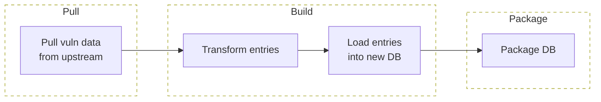
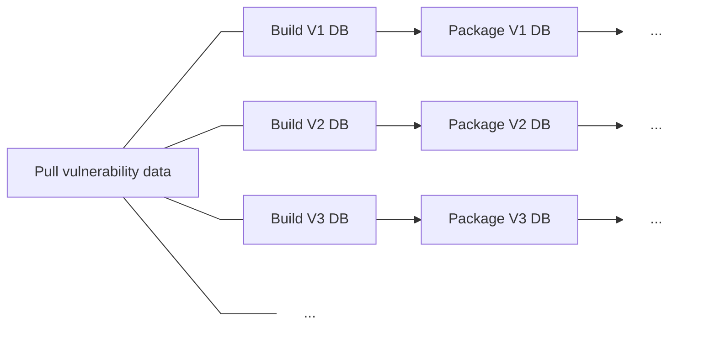
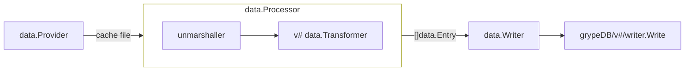
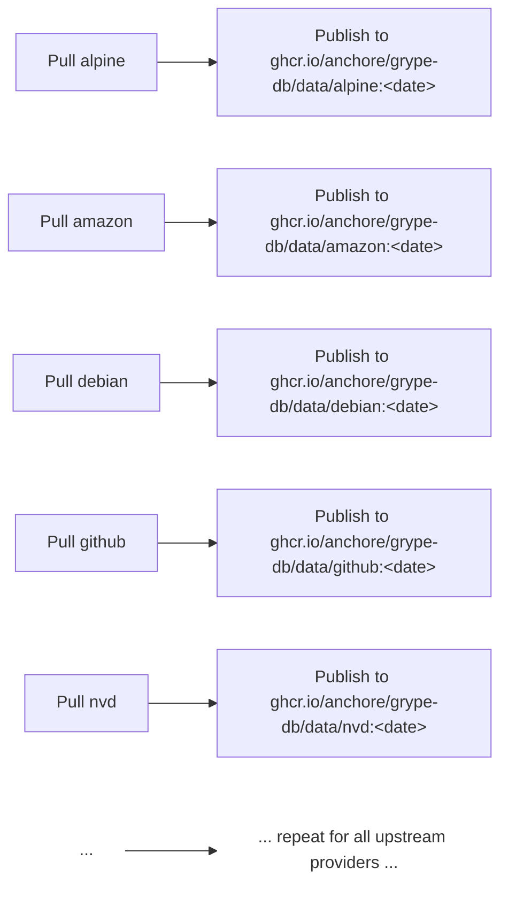
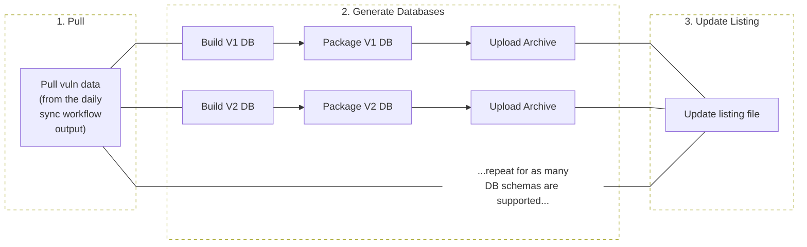

+++
title = "Grype DB"
description = "Architecture and design of the Grype vulnerability database build system"
weight = 30
categories = ["architecture"]
url = "docs/architecture/grype-db"
tags = ["grype-db", "vunnel"]
menu_group = "projects"
+++

## Overview

`grype-db` is essentially an application that extracts information from upstream vulnerability data providers, transforms it into smaller records targeted for Grype consumption, and loads the individual records into a new SQLite DB.



## Multi-Schema Support Architecture

What makes `grype-db` unique compared to a typical ETL job is the extra responsibility of needing to transform the most recent vulnerability data shape (defined in the [vunnel repo](https://github.com/anchore/vunnel/tree/main/schema/vulnerability)) to all supported DB schema versions.

From the perspective of the Daily DB Publisher workflow, (abridged) execution looks something like this:



## Core Abstractions

In order to support multiple DB schemas easily from a code-organization perspective, the following abstractions exist:

- **Provider** - Responsible for providing raw vulnerability data files that are cached locally for later processing.

- **Processor** - Responsible for unmarshalling any entries given by the `Provider`, passing them into `Transformers`, and returning any resulting entries. Note: the object definition is schema-agnostic but instances are schema-specific since Transformers are dependency-injected into this object.

- **Transformer** - Takes raw data entries of a specific [vunnel-defined schema](https://github.com/anchore/vunnel/tree/main/schema/vulnerability) and transforms the data into schema-specific entries to later be written to the database. Note: the object definition is schema-specific, encapsulating `grypeDB/v#` specific objects within schema-agnostic `Entry` objects.

- **Entry** - Encapsulates schema-specific database records produced by `Processors`/`Transformers` (from the provider data) and accepted by `Writers`.

- **Writer** - Takes `Entry` objects and writes them to a backing store (today a SQLite database). Note: the object definition is schema-specific and typically references `grypeDB/v#` schema-specific writers.

## Data Flow

All the above abstractions are defined in the `pkg/data` Go package and are used together commonly in the following flow:



Where there is:

- A `data.Provider` for each upstream data source (e.g. canonical, redhat, github, NIST, etc.)
- A `data.Processor` for every vunnel-defined data shape (github, os, msrc, nvd, etc... defined in the [vunnel repo](https://github.com/anchore/vunnel/tree/main/schema/vulnerability))
- A `data.Transformer` for every processor and DB schema version pairing
- A `data.Writer` for every DB schema version

## Code Organization

From a Go package organization perspective, the above abstractions are organized as follows:

```
grype-db/
└── pkg
    ├── data                      # common data structures and objects that define the ETL flow
    ├── process
    │    ├── processors           # common data.Processors to call common unmarshallers and pass entries into data.Transformers
    │    ├── v1
    │    │    ├── processors.go   # wires up all common data.Processors to v1-specific data.Transformers
    │    │    ├── writer.go       # v1-specific store writer
    │    │    └── transformers    # v1-specific transformers
    │    ├── v2
    │    │    ├── processors.go   # wires up all common data.Processors to v2-specific data.Transformers
    │    │    ├── writer.go       # v2-specific store writer
    │    │    └── transformers    # v2-specific transformers
    │    └── ...more schema versions here...
    └── provider                  # common code to pull, unmarshal, and cache updstream vuln data into local files
        └── ...

```

## DB Structure and Definitions

The definitions of what goes into the database and how to access it (both reads and writes) live in the public `grype` repo under the `db` package. Responsibilities of `grype` (not `grype-db`) include (but are not limited to):

- What tables are in the database
- What columns are in each table
- How each record should be serialized for writing into the database
- How records should be read/written from/to the database
- Providing rich objects for dealing with schema-specific data structures
- The name of the SQLite DB file within an archive
- The definition of a listing file and listing file entries

The purpose of `grype-db` is to use the definitions from `grype.db` and the upstream vulnerability data to create DB archives and make them publicly available for consumption via Grype.

## DB Listing File

The listing file contains URLs to Grype DB archives that are available for download, organized by schema version, and ordered by latest-date-first.

The definition of the listing file resides in `grype`, however, it is the responsibility of the grype-db repo to generate DBs and re-create the listing file daily.

As long as Grype has been configured to point to the correct listing file, the DBs can be stored separately from the listing file, be replaced with a running service returning the listing file contents, or can be mirrored for systems behind an air gap.

## Daily Workflows

There are two workflows that drive getting a new Grype DB out to OSS users:

1. The daily data sync workflow, which uses [vunnel](https://github.com/anchore/vunnel) to pull upstream vulnerability data.
2. The daily DB publisher workflow, which builds and publishes a Grype DB from the data obtained in the daily data sync workflow.

### Daily Data Sync Workflow

**This workflow takes the upstream vulnerability data (from canonical, redhat, debian, NVD, etc), processes it, and writes the results to OCI repos.**



Once all providers have been updated, a single vulnerability cache OCI repo is updated with all of the latest vulnerability data at `ghcr.io/anchore/grype-db/data:<date>`. This repo is what is used downstream by the DB publisher workflow to create Grype DBs.

The in-repo `.grype-db.yaml` and `.vunnel.yaml` configurations are used to define the upstream data sources, how to obtain them, and where to put the results locally.

### Daily DB Publishing Workflow

**This workflow takes the latest vulnerability data cache, builds a Grype DB, and publishes it for general consumption.**

The `manager/` directory contains all code responsible for driving the Daily DB Publisher workflow, generating DBs for all supported schema versions and making them available to the public. The publishing process is made of three steps:



#### 1. Pull

Download the latest vulnerability data from various upstream data sources into a local directory. The destination for the provider data is in the `data/vunnel` directory.

#### 2. Generate

Build databases for all supported schema versions based on the latest vulnerability data and upload them to S3.

This needs to be repeated for all schema versions that are supported (see `manager/src/grype_db_manager/data/schema-info.json`).

Once built, each DB is smoke tested with Grype by comparing the performance of the last OSS DB with the current (local) DB, using the [vulnerability-match-label](https://github.com/anchore/vulnerability-match-labels) to quality differences.

Only DBs that pass validation are uploaded to S3. At this step the DBs can be downloaded from S3 but are NOT yet discoverable via `grype db download` yet (this is what the listing file update will do).

#### 3. Update Listing

Generate and upload a new listing file to S3 based on the existing listing file and newly discovered DB archives already uploaded to S3.

During this step the locally crafted listing file is tested against installations of Grype. The correctness of the reports are NOT verified (since this was done in a previous step), however, in order to pass the scan must have a non-zero count of matches found.

Once the listing file has been uploaded, user-facing Grype installations should pick up that there are new DBs available to download.

## Related Architecture

For more details on:

- How Vunnel processes vulnerability data, see the [Vunnel Architecture](/docs/architecture/vunnel) page
- How quality gates validate database builds, see the [Quality Gates](/docs/architecture/quality-gates) section
