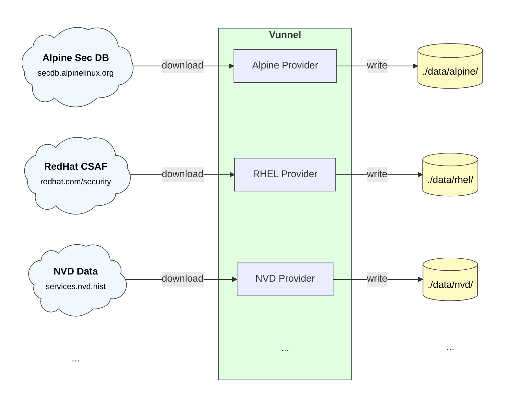
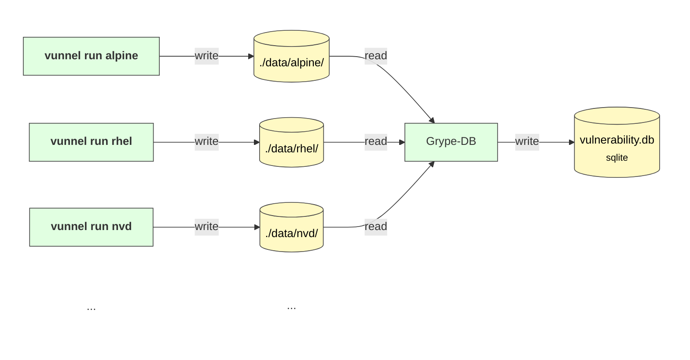
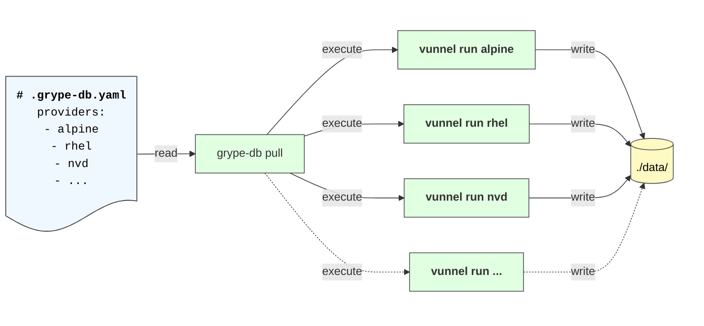
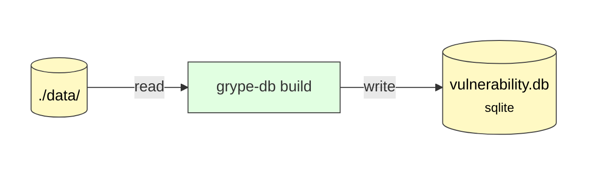
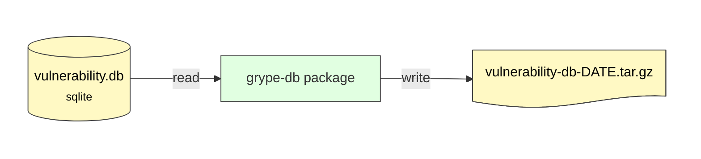

+++
title = "Vunnel"
description = "Architecture and design of the Vunnel vulnerability data processing tool"
weight = 40
categories = ["architecture"]
tags = ["vunnel"]
url = "docs/architecture/vunnel"
menu_group = "projects"
+++

## Overview

Vunnel is a CLI tool that downloads and processes vulnerability data from various sources (in the codebase, these are called "providers").



Conceptually, one or more invocations of Vunnel will produce a single data directory which Grype DB uses to create a Grype database:



## Integration with Grype DB

The Vunnel CLI tool is optimized to run a single provider at a time, not orchestrating multiple providers at once. [Grype DB](https://github.com/anchore/grype-db) is the tool that collates output from multiple providers and produces a single database, and is ultimately responsible for orchestrating multiple Vunnel calls to prepare the input data:

### grype-db pull



### grype-db build



### grype-db package



For more information about how Grype DB uses Vunnel see the [Grype DB Architecture](/docs/architecture/grype-db) page.

## Provider Architecture

A "Provider" is the core abstraction for Vunnel and represents a single source of vulnerability data. Vunnel is a CLI wrapper around multiple vulnerability data providers.

### Provider Requirements

All provider implementations should:

- Live under `src/vunnel/providers` in their own directory (e.g. the NVD provider code is under `src/vunnel/providers/nvd/...`)
- Have a class that implements the [`Provider` interface](https://github.com/anchore/vunnel/blob/1285a3be0f24fd6472c1f469dd327541ff1fc01e/src/vunnel/provider.py#L73)
- Be centrally registered with a unique name under [`src/vunnel/providers/__init__.py`](https://github.com/anchore/vunnel/blob/1285a3be0f24fd6472c1f469dd327541ff1fc01e/src/vunnel/providers/__init__.py)
- Be independent from other vulnerability providers data — that is, the debian provider CANNOT reach into the NVD data provider directory to look up information (such as severity)
- Follow the workspace conventions for downloaded provider inputs, produced results, and tracking of metadata

### Workspace Conventions

Each provider has a "workspace" directory within the "vunnel root" directory (defaults to `./data`) named after the provider.

```yaml
data/                       # the "vunnel root" directory
└── alpine/                 # the provider workspace directory
    ├── input/              # any file that needs to be downloaded and referenced should be stored here
    ├── results/            # schema-compliant vulnerability results (1 record per file)
    ├── checksums           # listing of result file checksums (xxh64 algorithm)
    └── metadata.json       # metadata about the input and result files
```

The `metadata.json` and `checksums` are written out after all results are written to `results/`. An example `metadata.json`:

```json
{
  "provider": "amazon",
  "urls": ["https://alas.aws.amazon.com/AL2022/alas.rss"],
  "listing": {
    "digest": "dd3bb0f6c21f3936",
    "path": "checksums",
    "algorithm": "xxh64"
  },
  "timestamp": "2023-01-01T21:20:57.504194+00:00",
  "schema": {
    "version": "1.0.0",
    "url": "https://raw.githubusercontent.com/anchore/vunnel/main/schema/provider-workspace-state/schema-1.0.0.json"
  }
}
```

Where:

- `provider`: the name of the provider that generated the results
- `urls`: the URLs that were referenced to generate the results
- `listing`: the path to the `checksums` listing file that lists all of the results, the checksum of that file, and the algorithm used to checksum the file (and the same algorithm used for all contained checksums)
- `timestamp`: the point in time when the results were generated or last updated
- `schema`: the data shape that the current file conforms to

### Result Format

All results from a provider are handled by a common base class helper (`provider.Provider.results_writer()`) and is driven by the application configuration (e.g. JSON flat files or SQLite database). The data shape of the results are self-describing via an envelope with a schema reference.

For example:

```json
{
  "schema": "https://raw.githubusercontent.com/anchore/vunnel/main/schema/vulnerability/os/schema-1.0.0.json",
  "identifier": "3.3/cve-2015-8366",
  "item": {
    "Vulnerability": {
      "Severity": "Unknown",
      "NamespaceName": "alpine:3.3",
      "FixedIn": [
        {
          "VersionFormat": "apk",
          "NamespaceName": "alpine:3.3",
          "Name": "libraw",
          "Version": "0.17.1-r0"
        }
      ],
      "Link": "http://cve.mitre.org/cgi-bin/cvename.cgi?name=CVE-2015-8366",
      "Description": "",
      "Metadata": {},
      "Name": "CVE-2015-8366",
      "CVSS": []
    }
  }
}
```

Where:

- The `schema` field is a URL to the schema that describes the data shape of the `item` field
- The `identifier` field should have a unique identifier within the context of the provider results
- The `item` field is the actual vulnerability data, and the shape of this field is defined by the schema

Note that the identifier is `3.3/cve-2015-8366` and not just `cve-2015-8366` in order to uniquely identify `cve-2015-8366` as applied to the `alpine 3.3` distro version among other records in the results directory.

Currently only JSON payloads are supported.

## Vulnerability Schemas

Possible vulnerability schemas supported within the vunnel repo are:

- [Generic OS Vulnerability](https://github.com/anchore/vunnel/tree/main/schema/vulnerability/os) - for OS distro vulnerabilities
- [GitHub Security Advisories](https://github.com/anchore/vunnel/tree/main/schema/vulnerability/github-security-advisory) - for GitHub advisory data
- [NVD Vulnerability](https://github.com/anchore/vunnel/tree/main/schema/vulnerability/nvd) - for NVD-specific data
- [Open Source Vulnerability (OSV)](https://ossf.github.io/osv-schema) - for OSV format data

If at any point a breaking change needs to be made to a provider (and say the schema remains the same), then you can set the `__version__` attribute on the provider class to a new integer value (incrementing from `1` onwards). This is a way to indicate that the cached input/results are not compatible with the output of the current version of the provider, in which case the next invocation of the provider will delete the previous input and results before running.

## Provider Configuration

Each provider has a configuration object defined next to the provider class. This object is used in the vunnel application configuration and is passed as input to the provider class. Take the debian provider configuration for example:

```python
from dataclasses import dataclass, field

from vunnel import provider, result

@dataclass
class Config:
    runtime: provider.RuntimeConfig = field(
        default_factory=lambda: provider.RuntimeConfig(
            result_store=result.StoreStrategy.SQLITE,
            existing_results=provider.ResultStatePolicy.DELETE_BEFORE_WRITE,
        ),
    )
    request_timeout: int = 125
```

### Configuration Requirements

Every provider configuration must:

- Be a `dataclass`
- Have a `runtime` field that is a `provider.RuntimeConfig` field

The `runtime` field is used to configure common behaviors of the provider that are enforced within the `vunnel.provider.Provider` subclass.

### Runtime Configuration Options

- **`on_error`**: what to do when the provider fails
  - `action`: choose to `fail`, `skip`, or `retry` when the failure occurs
  - `retry_count`: the number of times to retry the provider before failing (only applicable when `action` is `retry`)
  - `retry_delay`: the number of seconds to wait between retries (only applicable when `action` is `retry`)
  - `input`: what to do about the `input` data directory on failure (such as `keep` or `delete`)
  - `results`: what to do about the `results` data directory on failure (such as `keep` or `delete`)

- **`existing_results`**: what to do when the provider is run again and the results directory already exists
  - `delete-before-write`: delete the existing results just before writing the first processed (new) result
  - `delete`: delete existing results before running the provider
  - `keep`: keep the existing results

- **`existing_input`**: what to do when the provider is run again and the input directory already exists
  - `delete`: delete the existing input before running the provider
  - `keep`: keep the existing input

- **`result_store`**: where to store the results
  - `sqlite`: store results as key-value form in a SQLite database, where keys are the record identifiers values are the json vulnerability records
  - `flat-file`: store results in JSON files named after the record identifiers

Any provider-specific config options can be added to the configuration object as needed (such as `request_timeout`, which is a common field).

## Related Architecture

For more details on how Grype DB uses Vunnel output, see the [Grype DB Architecture](/docs/architecture/grype-db) page.

## Next Steps

- **[Vunnel Contributing Guide](/docs/contributing/vunnel)** - Learn how to build providers, run tests, and contribute code
- **[Grype DB Architecture](/docs/architecture/grype-db)** - Understand how Grype DB processes Vunnel output
- **[Grype Architecture](/docs/architecture/grype)** - See how vulnerability data is used during scanning
