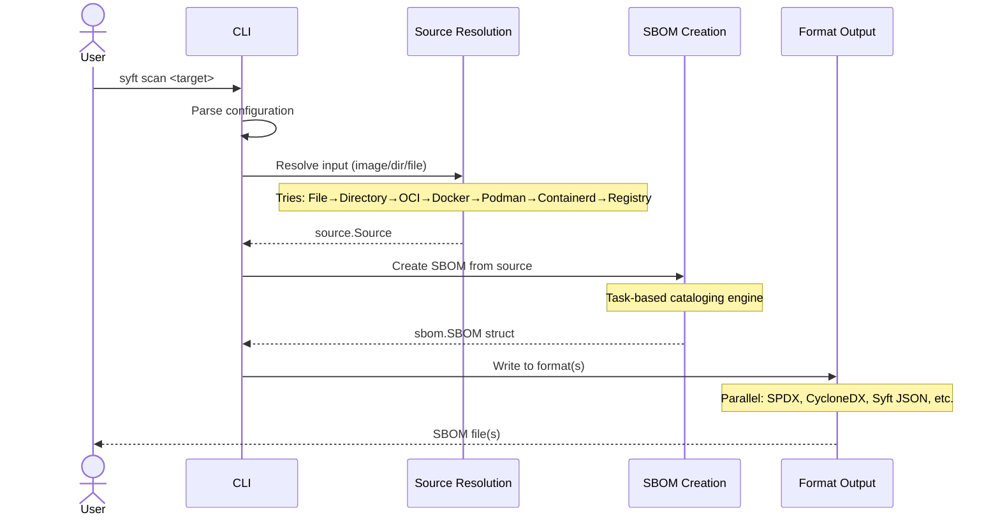
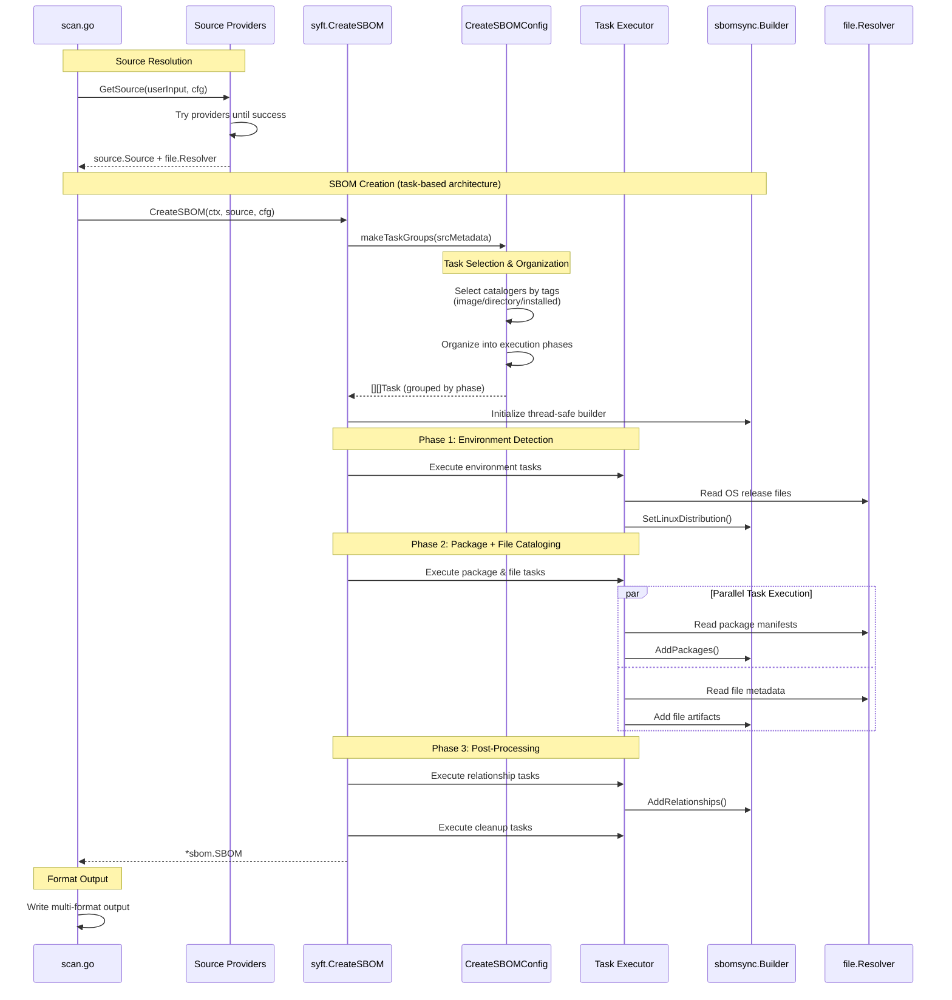

+++
title = "Syft"
description = "Architecture and design of the Syft SBOM tool"
weight = 10
categories = ["architecture"]
tags = ["syft"]
menu_group = "projects"
icon_image = "/images/logos/syft/favicon-48x48.png"
+++


See the [Golang CLI Patterns]() for **common structures and frameworks** used in Syft and across other Anchore open source projects.

For detailed **API examples**, see the [Syft repository on GitHub](https://github.com/anchore/syft/tree/main/examples).


## Code organization

At a high level, this is the package structure of Syft:

```
./cmd/syft/                 // main entrypoint
│   └── ...
└── syft/                   // the "core" syft library
    ├── format/             // contains code to encode or decode to and from SBOM formats
    ├── pkg/                // contains code to catalog packages from a source
    ├── sbom/               // contains the definition of an SBOM
    └── source/             // contains code to create a source object for some input type (e.g. container image, directory, etc)
```

Syft's core library is implemented in the `syft` package and subpackages.
The major packages work together in a pipeline:

- The `syft/source` package produces a `source.Source` object that can be used to catalog a directory, container, and other source types.
- The `syft` package knows how to take a `source.Source` object and catalog it to produce an `sbom.SBOM` object.
- The `syft/format` package contains the ability to encode an `sbom.SBOM` object to and from different SBOM formats (such as SPDX and CycloneDX).

This design creates a clear flow: **source → catalog → format**:









Shows the task-based architecture and execution phases.
Tasks are selected by tags (image/directory/installed) and organized into serial phases, with parallel execution within each phase.







## The `Package` object

The [`pkg.Package`](https://github.com/anchore/syft/blob/main/syft/pkg/package.go) object is a core data structure that represents a software package.

Key fields include:

- `FoundBy`: the name of the cataloger that discovered this package (e.g. `python-pip-cataloger`).
- `Locations`: the set of paths and layer IDs that were parsed to discover this package.
- `Language`: the language of the package (e.g. `python`).
- `Type`: a high-level categorization of the ecosystem the package resides in. For instance, even if the package is an egg, wheel, or requirements.txt reference, it is still logically a "python" package. Not all package types align with a language (e.g. `rpm`) but it is common.
- `Metadata`: specialized data for specific location(s) parsed. This should contain as much raw information as seems useful, kept as flat as possible using the raw names and values from the underlying source material.

### Additional package `Metadata`

Packages can have specialized metadata that is specific to the package type and source of information.
This metadata is stored in the `Metadata` field of the `pkg.Package` struct as an `any` type, allowing for flexibility in the data stored.

When `pkg.Package` is serialized, an additional `MetadataType` field is shown to help consumers understand the datashape of the `Metadata` field.

By convention the `MetadataType` value follows these rules:

- Only use lowercase letters, numbers, and hyphens. Use hyphens to separate words.
- **Anchor the name in the ecosystem, language, or packaging tooling**. For language ecosystems, prefix with the language/framework/runtime. For instance `dart-pubspec-lock` is better than `pubspec-lock`. For OS package managers this is not necessary (e.g. `apk-db-entry` is good, but `alpine-apk-db-entry` is redundant).
- **Be as specific as possible to what the data represents**. For instance `ruby-gem` is NOT a good `MetadataType` value, but `ruby-gemspec` is, since Ruby gem information can come from a gemspec file or a Gemfile.lock, which are very different.
- **Describe WHAT the data is, NOT HOW it's used**. For instance `r-description-installed-file` is not good since it's trying to convey how we use the DESCRIPTION file. Instead simply describe what the DESCRIPTION file is: `r-description`.
- **Use the `lock` suffix** to distinguish between manifest files that loosely describe package version requirements vs files that strongly specify one and only one version of a package ("lock" files). These should only be used with respect to package managers that have the guide and lock distinction, but would not be appropriate otherwise (e.g. `rpm` does not have a guide vs lock, so `lock` should NOT be used to describe a db entry).
- **Use the `archive` suffix** to indicate a package archive (e.g. rpm file, apk file) that describes the contents of the package. For example an RPM file would have a `rpm-archive` metadata type (not to be confused with an RPM DB record entry which would be `rpm-db-entry`).
- **Use the `entry` suffix** to indicate information about a package found as a single entry within a file that has multiple package entries. If found within a DB or flat-file store for an OS package manager, use `db-entry`.
- **Should NOT contain the phrase `package`**, though exceptions are allowed if the canonical name literally has the phrase package in it.
- **Should NOT have a `file` suffix** unless the canonical name has the term "file", such as a `pipfile` or `gemfile`.
- **Should NOT contain the exact filename+extensions**. For instance `pipfile.lock` shouldn't be in the name; instead describe what the file is: `python-pipfile-lock`.
- **Should NOT contain the phrase `metadata`**, unless the canonical name has this term.
- **Should represent a single use case**. For example, trying to describe Hackage metadata with a single `HackageMetadata` struct is not allowed since it represents 3 mutually exclusive use cases: `stack.yaml`, `stack.lock`, or `cabal.project`. Each should have its own struct and `MetadataType`.

The goal is to provide a consistent naming scheme that is easy to understand. If the rules don't apply in your situation, use your best judgement.

When the underlying parsed data represents multiple files, there are two approaches:

- Use the primary file to represent all the data. For instance, though the `dpkg-cataloger` looks at multiple files, it's the `status` file that gets represented.
- Nest each individual file's data under the `Metadata` field. For instance, the `java-archive-cataloger` may find information from `pom.xml`, `pom.properties`, and `MANIFEST.MF`. The metadata is `java-metadata` with each possibility as a nested optional field.

## Package Catalogers

Catalogers are the mechanism by which Syft identifies and constructs packages given a targeted list of files.

For example, a cataloger can ask Syft for all `package-lock.json` files in order to parse and raise up JavaScript packages (see [file globs](https://github.com/anchore/syft/tree/v0.70.0/syft/pkg/cataloger/javascript/cataloger.go#L16-L21) and [file parser functions](https://github.com/anchore/syft/tree/v0.70.0/syft/pkg/cataloger/javascript/cataloger.go#L16-L21) for examples).

There is a [generic cataloger](https://github.com/anchore/syft/blob/main/syft/pkg/cataloger/generic) implementation that can be leveraged to
quickly create new catalogers by specifying file globs and parser functions (browse the source code for [syft catalogers](https://github.com/anchore/syft/tree/main/syft/pkg/cataloger) for example usage).

### Design principles

From a high level, catalogers have the following properties:

- **They are independent of one another**. The Java cataloger has no idea of the processes, assumptions,
  or results of the Python cataloger, for example.

- **They do not know what source is being analyzed**. Are we analyzing a local directory? An image?
  If so, the squashed representation or all layers? The catalogers do not know the answers to these questions.
  Only that there is an interface to query for file paths and contents from an underlying "source" being scanned.

- **Packages created by the cataloger should not be mutated after they are created**. There is one exception made
  for adding CPEs to a package after the cataloging phase, but that will most likely be moved back into the cataloger in the future.

### Naming conventions

Cataloger names should be unique and named with these rules in mind:

- Must end with `-cataloger`
- Use lowercase letters, numbers, and hyphens only
- Use hyphens to separate words
- Catalogers for language ecosystems should start with the language name (e.g. `python-`)
- Distinguish between when the cataloger is searching for evidence of installed packages vs declared packages. For example, there are two different gemspec-based catalogers: `ruby-gemspec-cataloger` and `ruby-installed-gemspec-cataloger`, where the latter requires that the gemspec is found within a `specifications` directory (meaning it was installed, not just at the root of a source repo).

### File search and selection

All catalogers are provided an instance of the [`file.Resolver`](https://github.com/anchore/syft/blob/v0.70.0/syft/source/file_resolver.go#L8) to interface with the image and search for files.
The implementations for these abstractions leverage [`stereoscope`](https://github.com/anchore/stereoscope) to perform searching.
Here is a rough outline how that works:

1. A stereoscope `file.Index` is searched based on the input given (a path, glob, or MIME type). The index is relatively
   fast to search, but requires results to be filtered down to the files that exist in the specific layer(s) of interest.
   This is done automatically by the `filetree.Searcher` abstraction. This abstraction will fallback to searching
   directly against the raw `filetree.FileTree` if the index does not contain the file(s) of interest.
   Note: the `filetree.Searcher` is used by the `file.Resolver` abstraction.

2. Once the set of files are returned from the `filetree.Searcher` the results are filtered down further to return
   the most unique file results. For example, you may have requested files by a glob that returns multiple results.
   These results are filtered down to deduplicate by real files, so if a result contains two references to the same file
   (one accessed via symlink and one accessed via the real path), then the real path reference is returned and the symlink
   reference is filtered out. If both were accessed by symlink then the first (by lexical order) is returned.
   This is done automatically by the `file.Resolver` abstraction.

3. By the time results reach the `pkg.Cataloger` you are guaranteed to have a set of unique files that exist in the
   layer(s) of interest (relative to what the resolver supports).

## CLI and core API

The CLI (in the `cmd/syft/` package) and the core library API (in the `syft/` package) are separate layers with a clear boundary.
Application level concerns always reside with the CLI, while the core library focuses on SBOM generation logic.
That means that there is an application configuration (e.g. `cmd/syft/cli`) and a separate library configuration, and when the CLI uses
the library API, it must adapt its configuration to the library's configuration types. In that adapter, the CLI layer
defers to API-level defaults as much as possible so there is a single source of truth for default behavior.

See the [Syft reponitory on GitHub](https://github.com/anchore/syft/tree/main/examples) for detailed API example usage.
