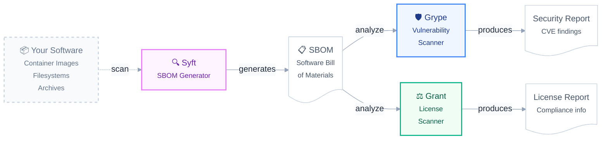

+++
title = "Projects"
description = "Overview of Anchore Open Source tools."
weight = 5
tags = ["syft", "grype", "grant"]
url = "docs/projects"
+++

We maintain three popular command-line tools, some libraries, and supporting utilities. Most are written in Go, with a few in Python. They are all released under the Apache-2.0 license. For the full list, see our [GitHub org](https://github.com/orgs/anchore/repositories).

Anchore's tools follow a simple workflow: search and raise up evidence in the form of a Software Bill of Materials (SBOM) using **Syft**,
then analyze that SBOM with **Grype** for security vulnerabilities and **Grant** for open source license compliance.

This modular approach lets you generate the SBOM once with Syft, then use Grype and Grant independently to scan for different types of risk.

####  Syft


<b>Syft</b> (pronounced like <i>sift</i>) is an open-source command-line tool and Go library. Its primary function is to scan container images, file systems, and archives to automatically generate a Software Bill of Materials, making it easier to understand the composition of software.  


####  Grype


<b>Grype</b> (pronounced like <i>hype</i>) is an open-source vulnerability scanner specifically designed to analyze container images and filesystems. It works by comparing the software components it finds against a database of known vulnerabilities, providing a report of potential risks so they can be addressed.


####  Grant


<b>Grant</b> is an open-source command-line tool designed to discover and report on the software licenses present in container images, SBOM documents, or filesystems. It helps users understand the licenses of their software dependencies and can check them against user-defined policies to ensure compliance.


### Installing the Tools

The tools are available in many common distribution channels. The full list of official and community maintained packages can be found on the [installation](/docs/installation) page.

### Using the Tools

We have "Getting Started" user guides for [SBOM Generation](/docs/guides/sbom/getting-started) with Syft, [Vulnerability Scanning](/docs/guides/sbom/getting-started) with Grype, and [License Scanning](/docs/guides/license/getting-started).

### Developing

Developers also have [Contribution Guides](/docs/contributing/) for all of our open source tools and libraries.
